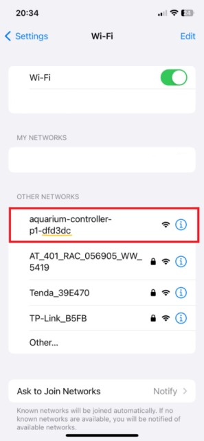
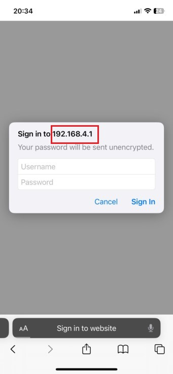
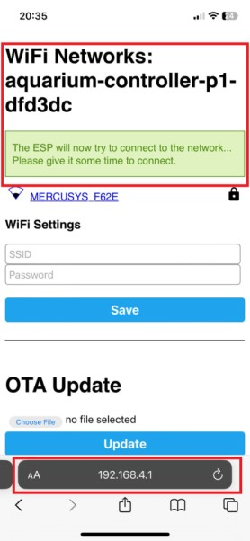

# Utilizati pagina aceasta pentru a configura dispozitivul Aquarium Controller.

Toate dispozitivele contin softul preinstlat.
{: .highlight }

{: .note-title }
> ## Cerinte prealabile:
>
> Router functional

Dupa conectarea dispozitivul la o sursa de curent de 12v cu alimentatorul din pachet, acesta o sa fie vizibil ca si o retea WiFi.

1. Puteti sa folositi orice laptop, calculator (care are WiFi) sau telefon pentru a va conecta la dispozitiv, efectuand setarilor necesare dispozitivului pentru conectarea la reteaua WiFi locala.
Deoarece dispozitivul foloseste un cip ESP32, doar retele WiFi pe 2.4 GHz o sa fie disponibile pentru conectare. 
Recomandam evitarea folosirii retelelor combinate de 2.5 GHz si 5 GHz, pentru a exclude ulterioare probleme de conexiunea.

	

	{: .note}
	> ##### Nume dispozitiv: aquarium_controller-p1-mac_dispozitiv
	

2. Dupa conectarea la dispozitiv, o sa fiti redirectionati in pagina cu setarile pentru conexiunea la reteaua WiFi locala.
		
	{: .note}
	> #####	NOTA: Daca nu s-a facut redirectionarea la pagina de conectare a dispozitivului, in orice browser (Edge, Chrome, FireFox) tastati adresa: http://192.168.4.1

	

3. Odata conectat la dispozitiv folositi datele de acces de pe spatele dispozitivului 
	utilizator (username) si parola (password) pentru a obtine acces.

4. Dupa ce ati selectat reteaua WiFi si ati introdus parola, dispozitivul o sa se conecteze la reteaua dumneavoastra locala.

		

5. In functie de ce model de router aveti, cautati adresa IP a dispozitivului adaugat (ex: 192.168.1.40). 
	
	

6. Folosing un browser web tastati adresa IP a dispozitivului pentru a va putea conecta la interfata WEB (http://192.168.1.105).

7. Folositi datele de acces de pe spatele dispozitivului: utilizator (username) si parola (password)
	

## Calibrare:
Pentru o calibrare adecvata a dispozitivului folositi urmatorii pasi:

1. Montati pompa pe sticla.

2. Folosind clema din pachet aranjati furtunul pe marginea acvariunui si ajustati lungimea lui. 

3. Din interfata dispoiztivului porniti pompa si asteptati pana ce lichidul care este extras din sticla (recipient) ajunge la capatul furtunului (cel de pe marginea acvariului) si opriti pompa. Acest pas este foarte important in calibrarea dispizitivului. 
Furtunul trebuie neaparat sa fie plin cu lichid pentru a incepe calibrarea.

4. Introduceti capatul furtunului (cel pentru acvariu) in recipientul gradat. Incercati sa nu scoateti lichidul din furtun in timp ce il manipulati.
5. Din interfata apasati butonul: **Start Calibration** si asteptati.
Procesul de calibrare o sa dureze 1 minut.
Explicatie: Timp de 1 minut recipientul gradat o sa fie umplut cu lichidul din sticla (container). Cantitatea de lichid rezultata o sa fie media de lichid pompata in acest interval de timp.

6. Masurati lichidul care se afla, dupa terminarea procesului de calibrare, in recipientul gradat. Este foarte important sa retineti cantitatea exacta afisata de recipientul gradat (ex: 6.2 ml)

7. In interfata dispozitivului la optiunea: **Calibration**	introduceti cantitatea masurata la pasul 6. La optiunea **State** ar trebui sa apara: 6.20 ml/minute. 

8. Dupa introducerea valorii, calibrarea este gata.

### Testarea:

1. Introduceti cantitatea de lichid pe care vreti sa o dozati in cadrul optiunii: **Dossing**
2. Asigurati-va ca recipientul gradat este gol si curat.
3. Introduceti capatul furtunului (cel pentru acvariu) in recipientul gradat.
4. Apasati: **Dose now** si asteptati.
5. Cantitatea de lichid din recipientul gradat trebuie sa fie egala cu valoarea introdusa la: **Dossing**
6. In cazul in care observati discrepante puteti repeta calibrarea.

## Recomandari:

> ### Optimizati calibrarea pentru doza de fertilizant pentru care o sa o folositi in acvariu:
Daca de exemplu trebuie sa dozati 5 ml de fertilizant in acvariu si in urma calibrarii si testarii obtineti o valoare de 4.8 ml puteti sa scadeti din valoarea introdusa la **Calibration**, 0.2 ml. In acest mod dozarea/minut o sa fie mai mica rezultand o crestere a timpului de dozare si in final mai mult fertilizant dozat. Puteti sa ajustati valoarea pana reusiti sa obtineti valoarea dorita de fertilizant.
> ### Verificati dispozitivul daca nu s-a decalibrat:
Functionarea pompei depinde de mai multi factori: lichidul folosit, colmatarea furtunului, lungimea furtunului, modul in care este aranjat furtunul, valva de sens unic, etc. Avand atatea componente care pot influenta buna functionare a dispozitivului si a pompei recomandam verificarea dozajului si recalibrarea daca este necesar cel putin odata pe luna.

