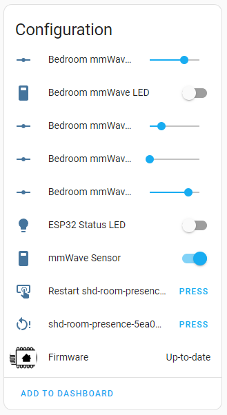

## Informatins about configuration options

>## Device leds:
>POWER led (green)             - always ON if device is connected to a power supply
>
>ESP32 cip status led (red)    - can be turned ON/OFF
>
>DFRobot SEN0395 led (red)     - can be turned ON/OFF
{: .note-title }

>## mmWave Options:
>mmWave Sensor                 - turn ON/OFF sensor
>
>mmWave Distance               - set detection distance
>
>mmWave Sensitivity            - set sensitivity of the sensor
>
>mmWave Off Latency            - time to set presence OFF after detection 
>
>mmWave On Latency             - time to set presence ON on detection
{: .note-title }

## Options stored into yaml file
### Offsets to calibrate sensors. You can replace default values.
>temperature_offset: "-11.5" 
>
>humidity_offset: "0" 
>
>illuminance_offset: "-10" 

### Update interval for sensors
>temperature_update_interval: "20s"
>
>illuminance_update_interval: "20s"

### Turn OFF delay for sensors
>pir_delay_off: "30s"
>
>occupancy_delay_off: "60s"
{: .note-title }

>## RECOMANDATIONS
>### mmWave Sensor is very sensitive and can detect very small movements such as:
>Plants moving 
>
>Curtains moving
>
>Fans from computers
>
>Cats
>
>Dogs
>
>In order to have a very good result you need to calibrate the sensor by tweaking settings based on your environment and placement of the device
{: .note-title }