# Use this page to configurate Room Presence device into Home Assistant.

All devices comes with preinstalled firmware.
{: .highlight }

{: .note-title }
> ## Prerequires:
>
> Install ESPHome Integration into Home Assistant.

Once you plug them on a power source of 5v with an MicroUSB cable or using pins(5v and ground) from board (by defauld is not enabled - need to solder pins), the device will be discovered as an WiFi device.

1. You can use any laptop, computer (that have WiFi) or phone to connect to it and enroll the device to you local WiFi network.
Because device is using an ESP32 cip will be able to connect to ONLY 2.4 GHz WiFi networks. 
Please avoid using combined 2.5 GHz and 5 GHz WiFi networks because ESP32 may cause issues.

	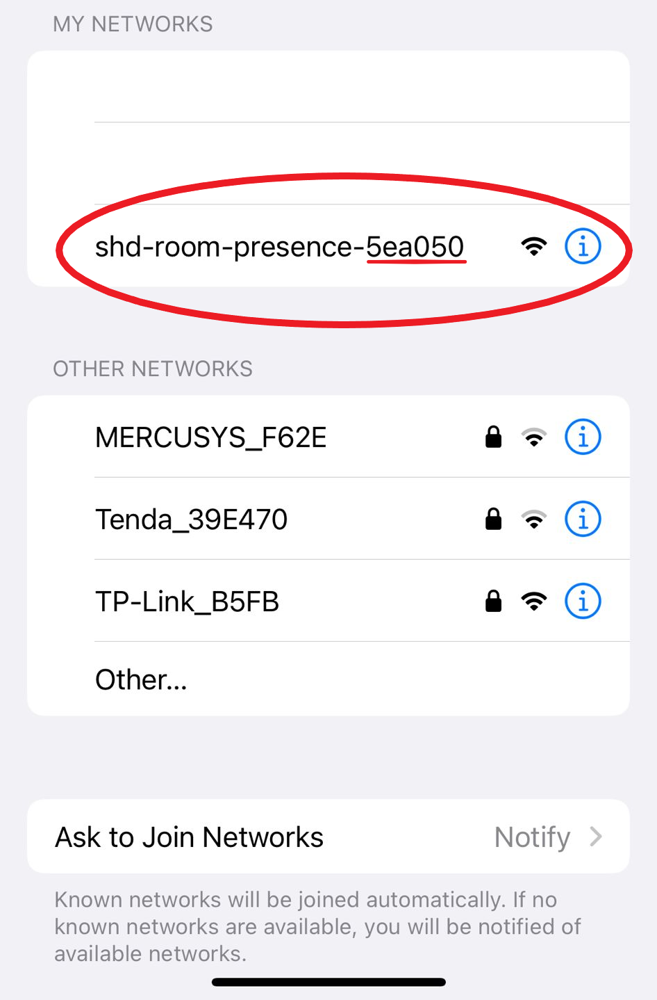

	{: .note}
	> ##### Device name: shd-room-presence-mac_of_the_device
	> ##### If you have multiple devices as new devices probably is a good idea to connect them one by one base on the room you wanna put that device because otherwise you will lose track on what device is, in what room 

2. After you are connected to your device a redirect page will bring you on device network setup page.

	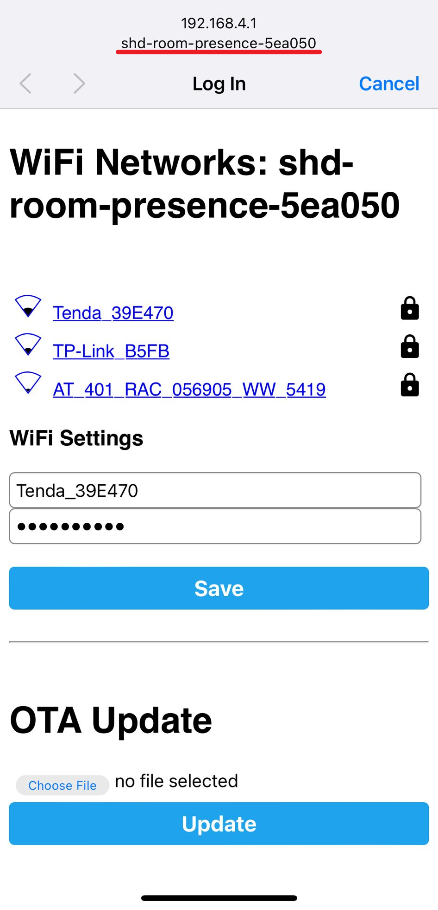

	Once you entered WiFi network and password you device it should connect to your WiFi network.

3. If device is connected successful on WiFi network will be discovered by Home Assistance. 
	It should be a notification like this:
	
	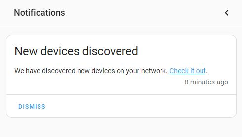

	{: .note}
	> If you wait 30 seconds and is not discovered by Home Assistance you can restart the device and check if is connecting to WiFi network (maybe check router settings)
	> 
	> If is not connecting after a restart try to restart your Home Assistant.
	> 
	> After all steps from (3) if the notification is still not displayed try (4)

4. In Home Assistant go to: 
	### Settings - Devices & Services 
	and you should see the device here:

	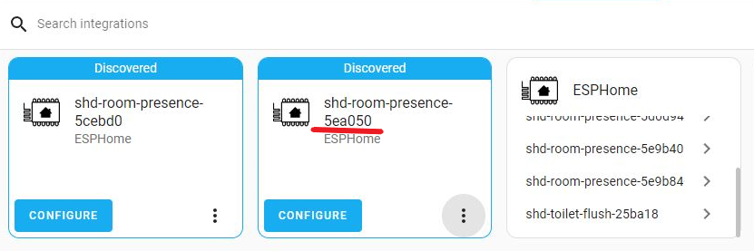

5. Click on device CONFIGURE
	
	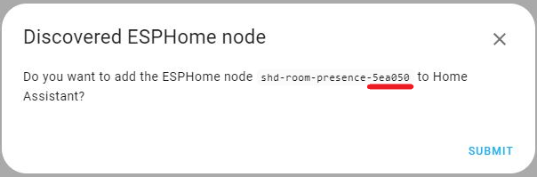

6. If configuration is succesfully you will receive a notification to select the area (room for the device)

	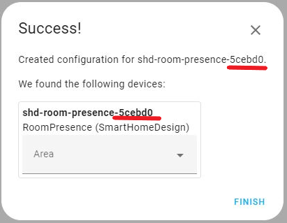

7. After you select the area check ESPHome integration and you should find the device in there (base on the name)
	
	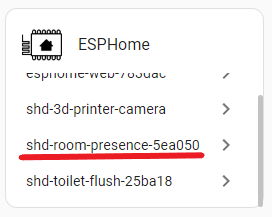

8. Select the device that you just installed

	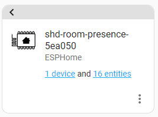

9. If you click on device you should have all available sensors added in Home Assistant with default_room name
	
	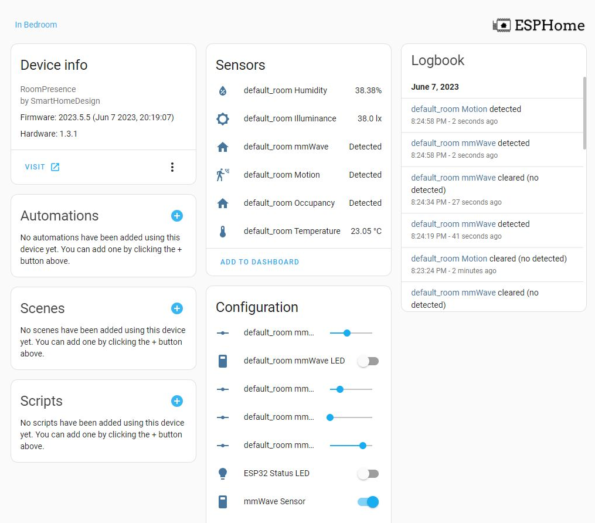

8. In order to change device room name you have 2 options.
	
	1. RECOMANDED: In ESPHome a new device will be descovered there for ADOPT.
		
		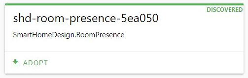
	
	2. You can change the device name then change entities name for that device
		
	
9. After your devices is ADOPED in ESPHome and installed you will see the yaml code for that device
	
	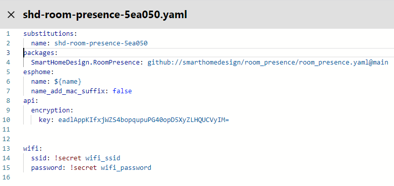

10. Add specific substitution code into yaml after name (row 2 in yaml):
	
	````markdown 
	room: "Bedroom" # replace this with your room name
	  temperature_offset: "-11.5"
	  humidity_offset: "0"
	  illuminance_offset: "-10"
	  temperature_update_interval: "20s"
	  illuminance_update_interval: "20s"
	  pir_delay_off: "30s"
	  occupancy_delay_off: "60s"
	```` 
	You can find full yaml code for device [here](https://github.com/smarthomedesign/room_presence/blob/main/room_presence.yaml)

11. Replace room value with your room name that will host that device.

	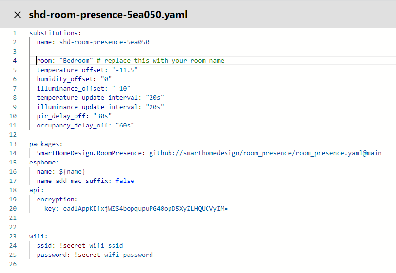

12. Install new firmware

13. After installation is completed in Home Assistant under 
	Settings - Devices & Services and ESPHome integration select the newly added device and you will find entity names changed with the room name
	
	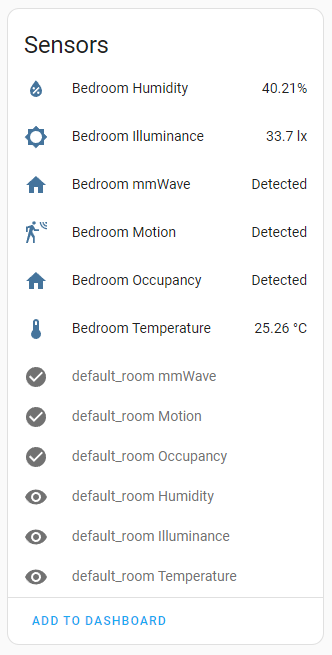

14. In there you will see old entities called: default_room_<sensor_name> that are inactive. 
	After a Home Assistant restart you can delete them.
