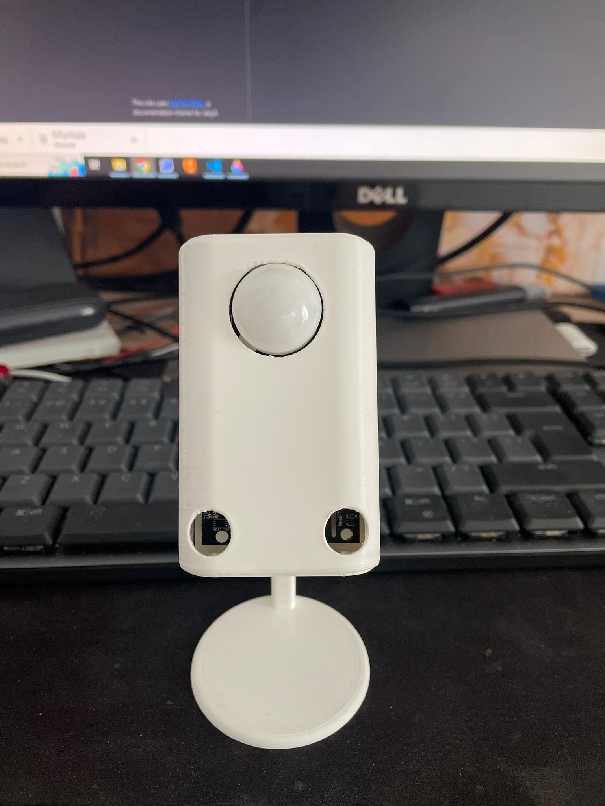

## General presentation of the Room Presence

Room presence is a multisensor device that can detect:
* Ambient Light
* Humidity and Temperature
* Motion
* Presence

All sensors have an corespondent entity in Home Assistant that ca be used in automations.
    
