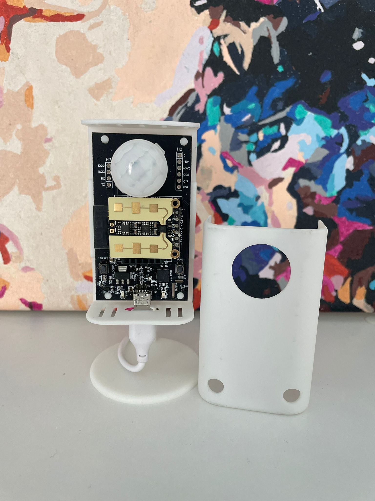

# Hardware Overview

## Room Presence RP1 board contain:

* ESP32-WROOM-32E ([datasheet](https://www.espressif.com/sites/default/files/documentation/esp32-wroom-32e_esp32-wroom-32ue_datasheet_en.pdf))
* BH1750FVI Ambient Light Sensor ([datasheet](https://datasheet.lcsc.com/lcsc/1811081611_ROHM-Semicon-BH1750FVI-TR_C78960.pdf))
* SHT4x Humidity and Temperature Sensor ([datasheet](https://datasheet.lcsc.com/lcsc/2110211930_Sensirion-SHT40-AD1B-R2_C2909890.pdf))
* MicroUSB for power and programming ([datasheet](https://datasheet.lcsc.com/lcsc/2304140030_MOLEX-1050170001_C136000.pdf))
* Socket for PIR Sensor ([datasheet](https://ro.mouser.com/datasheet/2/273/MMMC_S_A0003807898_1-2555043.pdf))
* Pin Headers for DFRobot SEN0395
* Additional GPIO pins for expansion and power (optional)

## Depending on ther board you have, if is full equiped board you will also have:

* Panasonic PIR Sensor ([datasheet](https://ro.mouser.com/datasheet/2/315/PANA_S_A0009105372_1-2560853.pdf))
* DFRobot SEN0395 - 24GHz millimeter-wave radar sensor ([datasheet](https://www.dfrobot.com/product-2282.html))