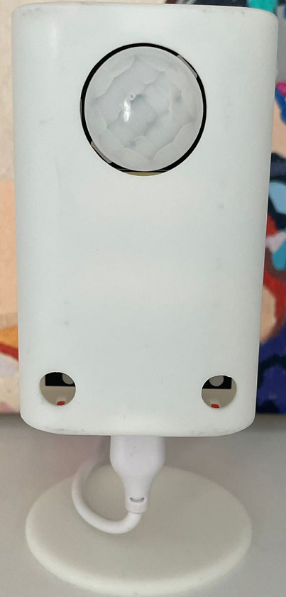
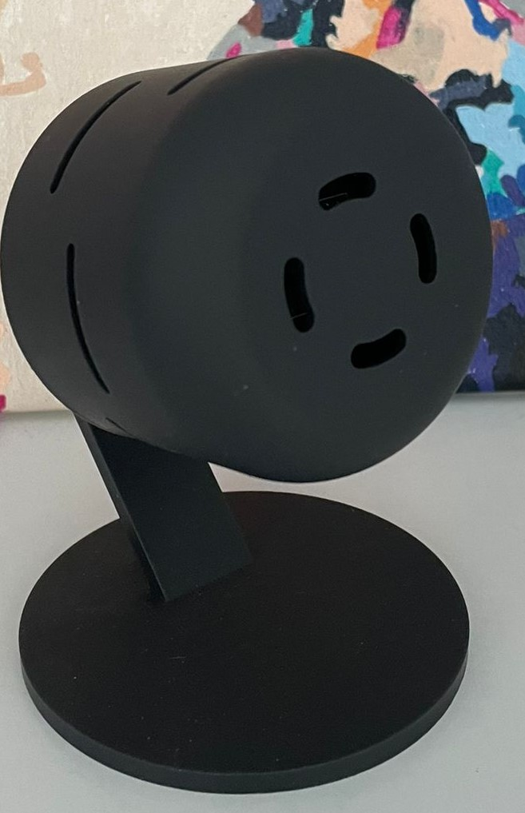
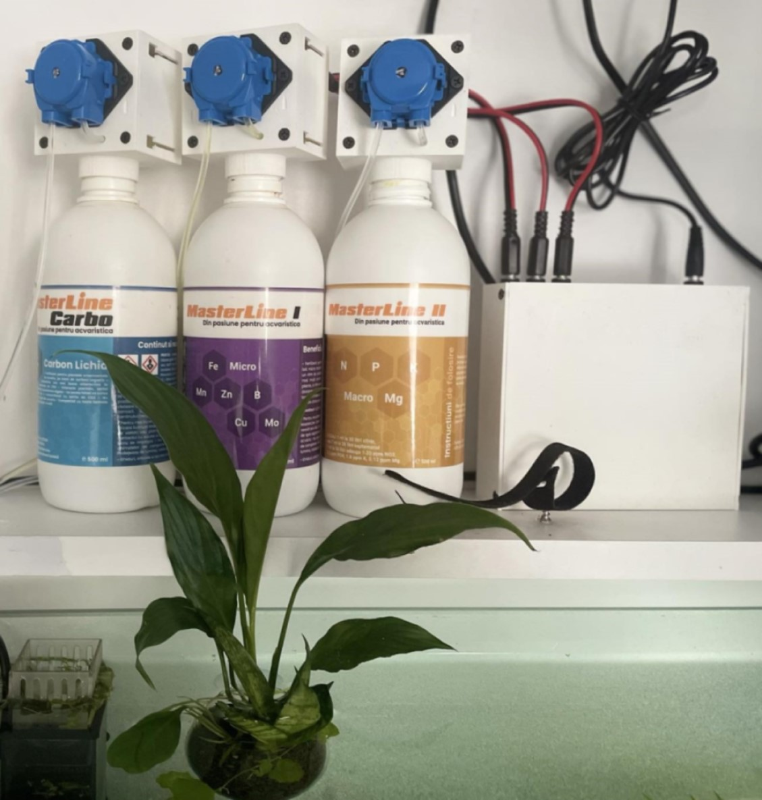

Introducing our lineup of smart devices powered by the ESP32 chip – the pinnacle of IoT innovation. With ESPHome and Home Assistant integration, controlling and automating your smart home has never been simpler. Enjoy the benefits of seamless connectivity, easy setup, and endless customization options with ESPHome's intuitive platform.

Each device comes with a custom-made 3D printed case, tailored to fit and enhance its functionality. From sleek designs to personalized touches, our cases add a touch of sophistication to your smart home setup.

|:-------------|:--------------------|:------|
| Room Presence RP1   |   Room Presence RP2   |      Aquarium Controller   |
|| | |
